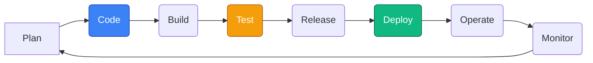
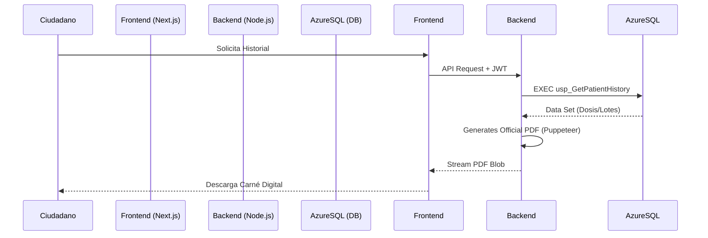

# <p align="center">📦 Vacunas RD: Sistema Nacional de Inmunización</p>

<p align="center">
  
  
  
</p>

---

### <p align="center">🚀 Una solución integral para la gestión de salud pública impulsada por una metodología DevOps de vanguardia.</p>

Este proyecto transforma la gestión de campañas de inmunización en un proceso digital eficiente, seguro y altamente escalable. No es solo una aplicación; es un ecosistema diseñado para administrar el ciclo completo de vacunación: desde el inventario en el centro hasta el carné digital en el bolsillo del ciudadano.

---

## 🛠️ Stack Tecnológico de Alto Rendimiento

| Capa | Tecnologías |
| :--- | :--- |
| **Frontend** |    |
| **Backend** |    |
| **Database** |   |
| **DevOps** |    |

---

## ♾️ Metodología DevOps Aplicada

Este proyecto fue concebido bajo el paradigma de **Integración Continua y Entrega Continua (CI/CD)**. Aplicamos los principios de DevOps para garantizar que cada cambio en el código pase por un proceso estricto de calidad antes de llegar al ciudadano.

### Ciclo de Vida del Proyecto


### Características DevOps Implementadas:
*   **Infrastructure as Code (IaC)**: Definición de servicios en la nube (Azure/Vercel) integrada en el repositorio.
*   **Cloud Hybrid Connectivity**: Backend en Vercel conectado de forma segura a una instancia persistente de Azure SQL.
*   **Automation**: Generación automática de certificados oficiales PDF utilizando Puppeteer Cloud-Optimized.
*   **Version Control**: Gestión de ramas para control de cambios dinámicos.

---

## ✨ Funcionalidades Estrella

### 🏛️ Para Instituciones (Admin/Médicos)
*   **Control de Lotes**: Gestión inteligente de inventario con alertas de caducidad.
*   **Agenda Digital**: Sistema de citas con validación de horarios en tiempo real.
*   **Certificación Oficial**: Generación de carnes con marca de agua y sellos digitales de seguridad.

### 👤 Para Ciudadanos (Pacientes)
*   **Perfil de Vacunación**: Acceso inmediato al historial completo de dosis aplicadas.
*   **Validación de Cédula**: Integración con algoritmos de validación de identidad dominicana.
*   **Responsive Web**: Diseñado para funcionar perfectamente desde un smartphone en el centro de vacunación.

---

## 🏛️ Arquitectura del Sistema



---

## 🚀 Guía de Instalación Rápida

### Entorno Local
1.  **Clonar y Dependencias**:
    ```bash
    git clone https://github.com/selinefeliz/Vacunas-RD.git
    npm install # En carpetas frontend y backend
    ```
2.  **Configurar Variables (.env)**:
    Asegúrate de configurar `DB_SERVER`, `DB_USER` y `DATABASE` para apuntar a tu instancia de Azure SQL.

3.  **Encender Motores**:
    ```bash
    # En Backend
    npm start
    # En Frontend
    npm run dev
    ```

---

## 👥 Equipo de Desarrollo
*   **Giselle Ventura** 
*   **Seline Feliz** 
*   **Ismael Moquete Eduardo** 
*   **Katriel Castillo** 
*   **Yobanny Velez**
*   **Emmanuel Cuello**
*  **Natasha Torres**
*  **Armani D'Oleo**  

---

<p align="center">
  Hecho con ❤️ para la salud de la República Dominicana.
</p>
